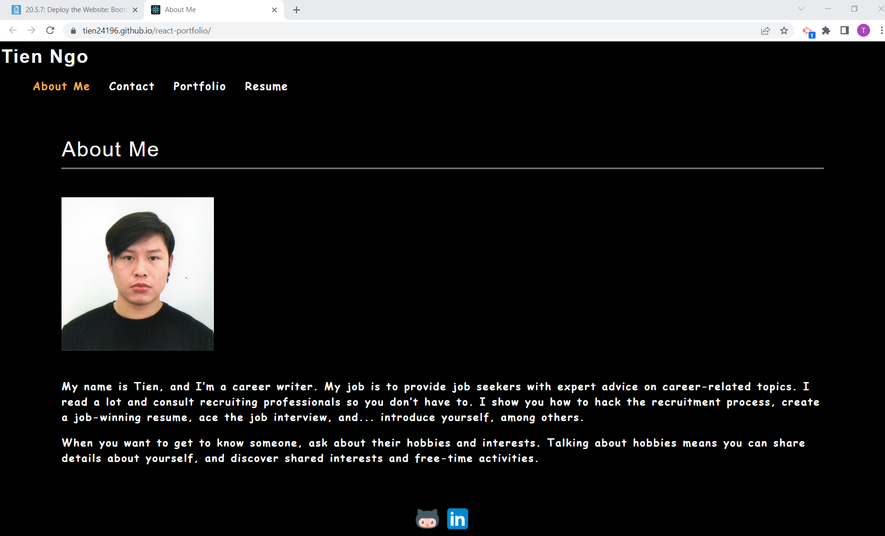

# Challenge XX: React Portfolio

## Description
Being a web developer means being part of a community. I’ll need a place to share your projects not only if you're applying for jobs or working as a freelancer but also so that you can share your work with fellow developers and collaborate on future projects. Using new React skills, I created and React Portfolio.

## Screenshot

## Deployed Application
https://tien24196.github.io/react-portfolio/

